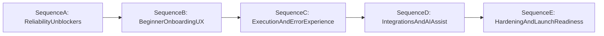

# Implementation Roadmap

## Delivery model

- Team size: one developer.
- Target horizon: 6 weeks.
- Sequencing rule: ship reliability and beginner activation before breadth expansion.

## Sequence overview

## Sequence A — Reliability unblockers (Week 1)

## Goals
- Remove errors that block graph CRUD and execution starts.
- Ensure auth, API connectivity, and CSP are stable in local/dev.

## Implementation focus
- Verify graph schema mapping consistency.
- Harden API error messages and status handling in web.
- Stabilize CSP and environment behavior for HTTP/WS in development.

## Primary files
- `code/apps/api/app/routers/graphs.py`
- `code/apps/web/lib/api/graphs.ts`
- `code/apps/web/next.config.ts`
- `code/apps/web/middleware.ts`

## Testing
- API smoke for graph create/get/update.
- Browser test for dashboard load and autosave success.
- Regression test for login/register and protected routes.

## Sequence B — Beginner onboarding UX (Week 2)

## Goals
- Make first successful workflow possible in under 10 minutes.

## Implementation focus
- Template picker on dashboard.
- Simplified node configuration in simple mode.
- Inline help/examples in node forms.

## Primary files
- `code/apps/web/app/dashboard/page.tsx`
- `code/apps/web/components/panels/NodeConfigPanel.tsx`
- `code/apps/web/components/canvas/NodePalette.tsx`
- `code/apps/web/lib/templates/*` (new)

## Testing
- E2E: open template -> run with minimal edits.
- Form validation tests for beginner presets.

## Sequence C — Execution and error experience (Week 3)

## Goals
- Make execution state understandable to non-technical users.

## Implementation focus
- Node-level test/run controls.
- Enhanced execution timeline with input/output preview.
- Friendly error cards with suggested fixes.

## Primary files
- `code/apps/web/components/canvas/FlowCanvas.tsx`
- `code/apps/web/components/panels/ExecutionLogPanel.tsx`
- `code/apps/web/lib/hooks/useExecution.ts`
- `code/apps/api/app/routers/executions.py`

## Testing
- WS reconnect and event ordering checks.
- Execution happy-path and failure-path UI tests.
- Approval-step interaction tests.

## Sequence D — Integrations and AI assist (Weeks 4-5)

## Goals
- Add highest business-value integrations.
- Speed up workflow creation with AI suggestions.

## Implementation focus
- Integration adapters for Slack, Gmail, Sheets, Notion.
- OAuth setup and credential management patterns.
- AI node suggestions and “build from prompt” prototype.

## Primary files
- `code/apps/api/app/services/mcp_gateway.py` (patterns)
- `code/apps/api/app/services/mcp_executor.py` (patterns)
- `code/apps/api/app/routers/*` (new integration routers)
- `code/apps/web/components/panels/MCPSearchPanel.tsx` (UX reference)
- `code/apps/web/components/canvas/FlowCanvas.tsx` (AI suggestions entrypoint)

## Testing
- Integration contract tests with mocked providers.
- Template run tests for at least 3 integration workflows.
- Security checks for OAuth token handling.

## Sequence E — Hardening and launch readiness (Week 6)

## Goals
- Prepare for stable release and reliable operations.

## Implementation focus
- Performance profiling for larger graphs.
- Rate limits, monitoring, and alerting validation.
- Final acceptance checklist and release gates.

## Primary files
- `code/apps/api/app/core/rate_limit.py`
- `code/apps/api/app/core/monitoring.py`
- `code/apps/web/lib/logger.ts`
- `code/k6/load_test.js`

## Testing
- Load test baseline and threshold validation.
- Full E2E journey pass for core user stories.
- Manual QA checklist sign-off.

## Priority and impact table

| Sequence | Priority | User impact | Risk if delayed |
|---|---|---|---|
| A | P0 | App becomes usable/stable | Core workflows remain blocked |
| B | P0 | Better first-run activation | New users drop due to complexity |
| C | P1 | Better trust and troubleshooting | Users cannot self-debug runs |
| D | P1 | Broader practical automations | Limited real-world adoption |
| E | P2 | Production confidence | Reliability and release risk |

## Risk register and mitigations

| Risk | Probability | Impact | Mitigation |
|---|---|---|---|
| Scope creep | High | High | Lock weekly acceptance scope before coding |
| Integration auth complexity | Medium | High | Reusable OAuth/token abstraction and mocks |
| Canvas UX regression | Medium | Medium | Feature flags + quick usability testing loops |
| Execution instability | Medium | High | Add deterministic tests for event order/retry |
| Performance degradation on large graphs | Medium | Medium | Profile before feature merges in Sequence E |

## Definition of roadmap success

- Beginner can run first template in under 10 minutes.
- Graph save/load and execution pass without critical blockers.
- 3 integration templates run end-to-end successfully.
- Release checklist is fully green with no P0/P1 defects.
