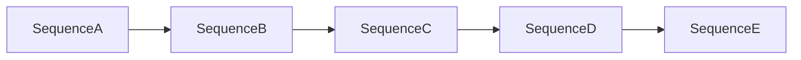

# Execution Backlog

## Usage notes

- Owner assumes one developer unless delegated.
- Estimates are in ideal dev days.
- Dependencies define strict order where needed.

## Backlog table

| ID | Sequence | Task | Files/Areas | Est. | Dependencies | Definition of done |
|---|---|---|---|---:|---|---|
| I2-A-01 | A | Graph payload consistency audit | `code/apps/api/app/routers/graphs.py` | 0.5 | None | DB `content` and API `json_content` mapping verified in tests |
| I2-A-02 | A | Frontend API error hardening | `code/apps/web/lib/api/graphs.ts` | 0.5 | I2-A-01 | Status/detail surfaced in user-facing errors |
| I2-A-03 | A | CSP dev/prod policy stabilization | `code/apps/web/next.config.ts` | 0.5 | None | Local API/WS allowed in dev and blocked rules validated |
| I2-A-04 | A | Auth flow regression checks | `code/apps/web/middleware.ts`, auth pages | 0.5 | I2-A-02 | Login/register/dashboard access paths pass manual + e2e smoke |
| I2-B-01 | B | Template domain model | `code/apps/web/lib/templates/*` | 1.0 | I2-A-04 | 5 templates with metadata available in code |
| I2-B-02 | B | Template picker UI | `code/apps/web/app/dashboard/page.tsx` | 1.0 | I2-B-01 | User can create graph from template in one click |
| I2-B-03 | B | Node config simple mode | `code/apps/web/components/panels/NodeConfigPanel.tsx` | 1.5 | I2-B-01 | Beginner labels/examples visible; advanced mode toggle works |
| I2-B-04 | B | Palette UX redesign | `code/apps/web/components/canvas/NodePalette.tsx` | 1.0 | I2-B-03 | Search/category/most-used filters available |
| I2-C-01 | C | Node-level test/run actions | `code/apps/web/components/canvas/FlowCanvas.tsx` | 1.0 | I2-A-04 | Test node and run flow controls operate correctly |
| I2-C-02 | C | Execution timeline enhancement | `code/apps/web/components/panels/ExecutionLogPanel.tsx` | 1.5 | I2-C-01 | Timeline shows status + duration + key I/O previews |
| I2-C-03 | C | Friendly error remediation | `code/apps/web/components/panels/ExecutionLogPanel.tsx`, API errors | 1.0 | I2-C-02 | Error cards include fix suggestions and next actions |
| I2-C-04 | C | WS reliability checks | `code/apps/web/lib/hooks/useExecution.ts` | 1.0 | I2-C-01 | Reconnect and run completion behavior tested |
| I2-D-01 | D | Integration abstraction scaffold | `code/apps/api/app/services/integrations/*` | 1.5 | I2-C-04 | Common interface for trigger/action connectors |
| I2-D-02 | D | Slack integration v1 | API service/router + web node config | 1.5 | I2-D-01 | Slack trigger/action can run in test and workflow mode |
| I2-D-03 | D | Gmail integration v1 | API service/router + web node config | 1.5 | I2-D-01 | Gmail send/read workflow path works |
| I2-D-04 | D | Sheets integration v1 | API service/router + web node config | 1.5 | I2-D-01 | Read/write rows node path works |
| I2-D-05 | D | Notion integration v1 | API service/router + web node config | 1.5 | I2-D-01 | Create/update page workflow works |
| I2-D-06 | D | AI workflow suggestion prototype | `FlowCanvas` + AI endpoint | 1.5 | I2-B-03 | User prompt generates starter node chain |
| I2-E-01 | E | Observability gate review | `code/apps/api/app/core/monitoring.py` | 0.5 | I2-C-04 | Core metrics visible and documented |
| I2-E-02 | E | Rate-limit and safety validation | `code/apps/api/app/core/rate_limit.py` | 0.5 | I2-E-01 | Limits enforced under test load |
| I2-E-03 | E | Load test baseline tuning | `code/k6/load_test.js` | 1.0 | I2-E-02 | Baseline p95 and failure rates captured |
| I2-E-04 | E | End-to-end release gate | E2E tests and manual QA docs | 1.0 | All above | Core journey green with no P0/P1 defects |

## Dependency summary

## Weekly execution suggestion (one developer)

- Week 1: I2-A-01..04
- Week 2: I2-B-01..04
- Week 3: I2-C-01..04
- Weeks 4-5: I2-D-01..06
- Week 6: I2-E-01..04
