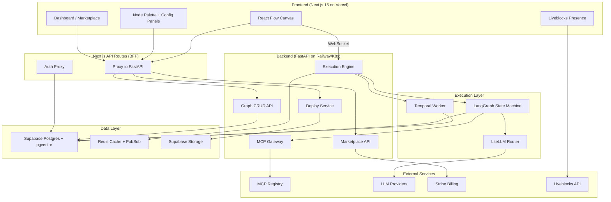
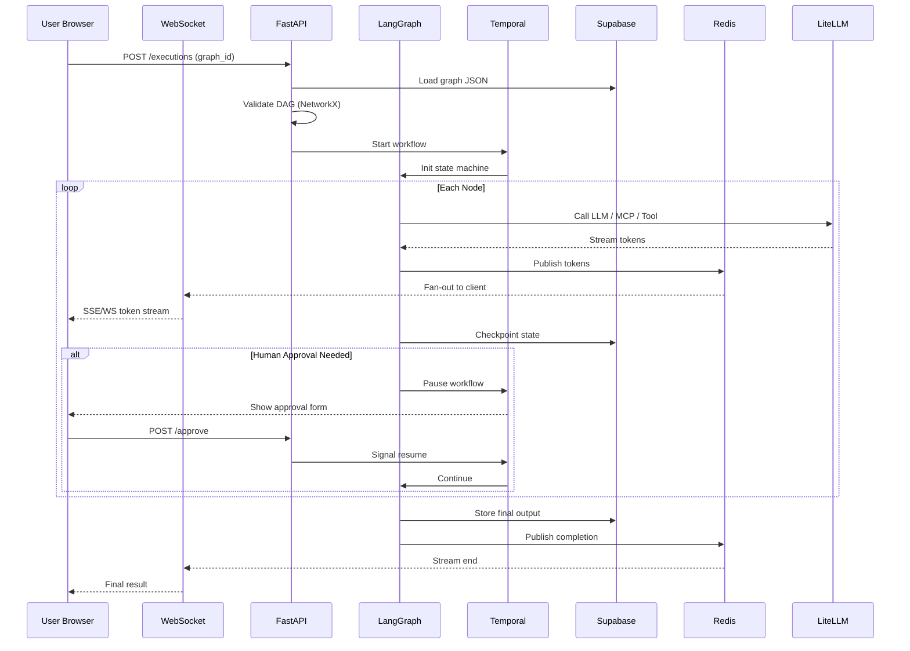

# Forge AI Workflow Studio — Architecture & Implementation Plan

---

## 1. SRS Analysis: Requirements, Gaps, and Assumptions

### Functional Requirements (confirmed)

- Visual DAG canvas (React Flow) with drag-and-drop node authoring
- 5 MVP node types: LLM Caller, RAG Retriever, Conditional Branch, MCP Tool, Approval Step (SRS mentions 12 total but only 5 are specified — remaining 7 deferred to post-MVP)
- Stateful execution engine with per-node checkpointing, retry, and streaming
- Human-in-the-loop approval with pause/resume
- MCP registry search, dynamic tool discovery, and execution
- 4 deployment targets for MVP: Cloud, MCP Server, Code Export, Docker (Widget and API deferred)
- Marketplace with Stripe metered billing
- Real-time collaboration via Liveblocks
- Graph versioning and CRUD with Zod validation

### Non-Functional Requirements (confirmed)

- 99.9% uptime, ≤0.5% error rate under 1000 concurrent users
- TLS 1.3, HTTP/2, ≤100ms API latency (p95)
- Checkpoints: ≤1MB JSON, AES-256 encrypted, 14-day TTL
- DAG cycle detection ≤50ms for 100 nodes
- Cloud deployment provisioning ≤20s
- MCP manifest fetch ≤5s with 1h cache

### Identified Gaps and Assumptions

- **Missing 7 node types**: SRS defines 5 of 12. Assumed remaining are: Code Executor, Text Transform, HTTP Request, Data Mapper, Loop/Iterator, Output Formatter, Memory/Context Store. Will implement as generic extensible node system.
- **Marketplace pricing model**: Not specified. Assuming per-template purchase + optional metered per-execution billing.
- **Audit log schema**: Mentioned for Enterprise but undefined. Will add `audit_logs(id, user_id, action, resource_type, resource_id, metadata, timestamp)`.
- **Rate limiting**: No thresholds specified. Assuming 100 req/min per user for API, 10 concurrent executions per user.
- **RAG document ingestion**: No upload/ingestion pipeline specified. Will add basic file upload + chunking in Epic 4.

---

## 2. Recommended Tech Stack

### Frontend (TypeScript)


| Layer          | Choice                          | Justification                                                                              |
| -------------- | ------------------------------- | ------------------------------------------------------------------------------------------ |
| Framework      | **Next.js 15** (App Router)     | SSR/SSG, API routes as BFF proxy, mature ecosystem. SRS says "16" but 15 is latest stable. |
| Canvas         | **React Flow v12**              | Per SRS. Best-in-class graph editor with custom nodes.                                     |
| UI             | **shadcn/ui + Tailwind CSS v4** | Per SRS. Composable, accessible, theming via CSS vars.                                     |
| State (client) | **Zustand**                     | Lightweight, works with React Flow's store pattern.                                        |
| State (server) | **TanStack Query v5**           | Cache invalidation, optimistic updates, WebSocket sync.                                    |
| Collaboration  | **Liveblocks**                  | Per SRS. Managed CRDT, presence, no Yjs infra to maintain.                                 |
| Validation     | **Zod**                         | Shared schemas between frontend forms and API contracts.                                   |
| Testing        | **Vitest + Playwright**         | Unit + E2E. Playwright for canvas interaction tests.                                       |


### Backend (Python)


| Layer          | Choice                    | Justification                                                          |
| -------------- | ------------------------- | ---------------------------------------------------------------------- |
| Framework      | **FastAPI**               | Per SRS. Async, auto-OpenAPI docs, Pydantic v2 validation.             |
| Execution      | **LangGraph v0.2**        | Per SRS. Python version is significantly more mature than JS.          |
| Orchestration  | **Temporal**              | Per SRS. Durable execution for long-running workflows, built-in retry. |
| LLM Routing    | **LiteLLM**               | Per SRS. Unified interface to 100+ LLM providers.                      |
| DAG Validation | **NetworkX**              | Per SRS. Cycle detection in ≤50ms for 100 nodes.                       |
| Embeddings     | **sentence-transformers** | Local embeddings for RAG, avoid API dependency for dev.                |
| Testing        | **pytest + httpx**        | Async test client for FastAPI, fixtures for DB/Redis.                  |


### Data Layer


| Layer        | Choice                                | Justification                                                 |
| ------------ | ------------------------------------- | ------------------------------------------------------------- |
| Database     | **Supabase (Postgres 15 + pgvector)** | Per SRS. Managed Postgres, built-in auth, RLS, vector search. |
| Cache/PubSub | **Redis (Upstash or self-hosted)**    | Per SRS. Execution state cache, WebSocket pub/sub fan-out.    |
| File Storage | **Supabase Storage**                  | RAG document uploads, code export ZIPs.                       |


### Infrastructure


| Layer           | Choice                                    | Justification                                                  |
| --------------- | ----------------------------------------- | -------------------------------------------------------------- |
| Monorepo        | **Turborepo**                             | Per SRS Phase 1. Parallel builds, caching, task orchestration. |
| CI/CD           | **GitHub Actions**                        | Per SRS. Matrix builds for TS + Python, Playwright in CI.      |
| Frontend Deploy | **Vercel**                                | Native Next.js support, edge functions, preview deploys.       |
| Backend Deploy  | **Railway** (dev) / **Kubernetes** (prod) | Simple container deploy for dev; K8s 1.28+ per SRS for prod.   |
| Monitoring      | **Sentry + Prometheus + Grafana**         | Per SRS Phase 6. Error tracking + metrics + dashboards.        |


### Why Polyglot (TS + Python) over Full TypeScript

The SRS mandates LangGraph, Temporal, and NetworkX — all Python-native with significantly more mature Python SDKs. The AI/ML ecosystem (embeddings, vector ops, LangChain tools) is richer in Python. The cost is a language boundary, mitigated by:

- Shared Zod/Pydantic schemas via code generation (`ts-to-zod` for Pydantic)
- OpenAPI auto-generated TypeScript client from FastAPI
- Clear API boundary with typed contracts

---

## 3. High-Level Architecture




### Data Flow — Workflow Execution




---

## 4. Project Structure

```
forge/
├── apps/
│   ├── web/                          # Next.js 15 frontend
│   │   ├── app/
│   │   │   ├── (auth)/login/         # Auth pages
│   │   │   ├── (dashboard)/          # Dashboard layout
│   │   │   ├── canvas/[id]/          # Canvas editor page
│   │   │   ├── marketplace/          # Browse/publish
│   │   │   └── api/                  # BFF proxy routes
│   │   ├── components/
│   │   │   ├── canvas/               # ReactFlow wrapper, controls
│   │   │   ├── nodes/                # Custom node renderers
│   │   │   ├── panels/               # Config side panels
│   │   │   └── ui/                   # shadcn components
│   │   ├── lib/
│   │   │   ├── api-client.ts         # Generated from OpenAPI
│   │   │   ├── stores/               # Zustand stores
│   │   │   └── hooks/                # Custom hooks
│   │   └── __tests__/
│   │
│   └── api/                          # FastAPI backend
│       ├── app/
│       │   ├── main.py               # FastAPI app + middleware
│       │   ├── routers/              # graph, execution, deploy, marketplace
│       │   ├── services/             # Business logic
│       │   │   ├── execution.py      # LangGraph orchestration
│       │   │   ├── mcp_gateway.py    # MCP fetch + cache
│       │   │   ├── deploy.py         # Deployment targets
│       │   │   └── marketplace.py    # Listing + billing
│       │   ├── models/               # Pydantic models
│       │   ├── core/                 # Config, security, deps
│       │   └── workers/              # Temporal workflow definitions
│       ├── tests/
│       └── pyproject.toml
│
├── packages/
│   └── shared-schemas/               # Zod schemas (source of truth)
│       ├── src/nodes.ts              # Node type schemas
│       ├── src/graph.ts              # Graph schema
│       └── codegen/                  # Pydantic generation script
│
├── docker/
│   ├── docker-compose.yml            # Local dev stack
│   ├── Dockerfile.web
│   └── Dockerfile.api
│
├── supabase/
│   └── migrations/                   # SQL migration files
│
├── .github/workflows/
│   ├── ci.yml                        # Lint, typecheck, test
│   └── deploy.yml                    # Staging/prod deploy
│
├── turbo.json
├── package.json
└── README.md
```

---

## 5. Data Model (Expanded from SRS)

```sql
-- Core tables
users (id UUID PK, email, role ENUM, avatar_url, created_at, updated_at)
graphs (id UUID PK, user_id FK, title, description, json_content JSONB, version INT, is_public BOOL, created_at, updated_at)
graph_runs (id UUID PK, graph_id FK, user_id FK, status ENUM, started_at, completed_at, error TEXT)
checkpoints (id UUID PK, graph_run_id FK, node_id, state JSONB, created_at)  -- TTL 14d
deployments (id UUID PK, graph_id FK, type ENUM, url, status ENUM, config JSONB, created_at)

-- Marketplace
marketplace_listings (id UUID PK, graph_id FK, author_id FK, title, description, price_cents INT, stripe_product_id, downloads INT, created_at)
purchases (id UUID PK, listing_id FK, buyer_id FK, stripe_payment_id, created_at)

-- Audit & MCP
audit_logs (id UUID PK, user_id FK, action, resource_type, resource_id, metadata JSONB, created_at)
mcp_cache (url TEXT PK, manifest JSONB, fetched_at TIMESTAMP)  -- TTL 1h

-- Indexes
CREATE INDEX idx_graphs_user ON graphs(user_id, updated_at DESC);
CREATE INDEX idx_checkpoints_run ON checkpoints(graph_run_id, created_at DESC);
CREATE INDEX idx_runs_graph ON graph_runs(graph_id, started_at DESC);
CREATE INDEX idx_listings_search ON marketplace_listings USING GIN(to_tsvector('english', title || ' ' || description));
```

---

## 6. Implementation Epics

### Epic 1: Project Foundation and Infrastructure (Week 1)

**Goal**: Local dev stack boots with `docker compose up`, CI pipeline passes.

**Key files to create**:

- `package.json`, `turbo.json` — monorepo root
- `apps/web/` — Next.js 15 scaffold with Tailwind + shadcn init
- `apps/api/pyproject.toml`, `apps/api/app/main.py` — FastAPI skeleton
- `docker/docker-compose.yml` — Postgres, Redis, API, Web
- `.github/workflows/ci.yml` — lint, typecheck, pytest, vitest
- `supabase/migrations/001_init.sql` — base schema

**Tasks**:

- Init Turborepo monorepo with `apps/web` and `apps/api` workspaces
- Scaffold Next.js 15 (App Router) with TypeScript strict mode
- Install and configure shadcn/ui with Tailwind CSS v4
- Scaffold FastAPI with Pydantic v2, CORS, health endpoint
- Write Docker Compose for local Postgres 15 + pgvector, Redis 7, FastAPI, Next.js dev
- Create GitHub Actions CI: parallel jobs for TS (eslint, tsc, vitest) and Python (ruff, mypy, pytest)
- Run initial Supabase migration with Users + Graphs tables
- Add `shared-schemas` package with initial Zod graph schema

**Risks**: Turborepo + Python interop may need custom pipeline config (mitigate: use `turbo.json` `dependsOn` with Docker for Python tasks).

---

### Epic 2: Authentication and Core Data Model (Week 1-2)

**Goal**: Users can sign up, log in, and have RLS-protected data access.

**Key files to create**:

- `apps/web/app/(auth)/login/page.tsx` — login page
- `apps/web/lib/supabase.ts` — Supabase client config
- `apps/api/app/core/auth.py` — JWT verification middleware
- `supabase/migrations/002_rls.sql` — RLS policies

**Tasks**:

- Configure Supabase Auth (email/password + GitHub OAuth)
- Build login/signup UI with shadcn forms
- Implement FastAPI middleware to verify Supabase JWT tokens
- Write RLS policies for all tables (users own their graphs)
- Create Next.js middleware for protected routes
- Add user profile API (GET/PATCH)
- Write auth integration tests (pytest + Vitest)

**Risks**: Supabase JWT verification in FastAPI needs `python-jose` with correct JWKS endpoint (mitigate: use `supabase-py` auth helpers or custom JWKS caching).

---

### Epic 3: Visual Canvas and Graph CRUD (Weeks 2-3)

**Goal**: Users can drag nodes, connect edges, configure, save, and reload graphs.

**Key files to create**:

- `apps/web/app/canvas/[id]/page.tsx` — canvas editor page
- `apps/web/components/canvas/FlowCanvas.tsx` — React Flow wrapper
- `apps/web/components/nodes/LLMCallerNode.tsx` (+ other node renderers)
- `apps/web/components/panels/NodeConfigPanel.tsx` — side panel
- `apps/api/app/routers/graphs.py` — CRUD endpoints
- `apps/api/app/services/dag_validator.py` — NetworkX cycle detection
- `packages/shared-schemas/src/nodes.ts` — node type Zod schemas

**Tasks**:

- Build React Flow canvas with custom node types (5 MVP types)
- Implement drag-and-drop node palette with icons and categories
- Build Zod-validated configuration panels per node type
- Create Graph CRUD API (POST, GET, PATCH, DELETE) with Zod/Pydantic validation
- Implement DAG cycle detection service (NetworkX, ≤50ms assertion)
- Add auto-save with 2s debounce + optimistic updates
- Build dashboard page with graph list (cards with title, updated_at, status)
- Write Playwright E2E: create graph, add nodes, connect, save, reload, verify

**Risks**: React Flow state management complexity with undo/redo (mitigate: use React Flow's built-in `useReactFlow` + Zustand for undo stack). Canvas performance with 100+ nodes (mitigate: React Flow virtualization is built-in).

---

### Epic 4: Execution Engine and Streaming (Weeks 4-6)

**Goal**: Run a graph with LLM nodes and see streaming tokens in the UI.

**Key files to create**:

- `apps/api/app/services/execution.py` — graph-to-LangGraph compiler
- `apps/api/app/services/llm_caller.py` — LiteLLM wrapper
- `apps/api/app/services/rag_retriever.py` — pgvector search
- `apps/api/app/routers/executions.py` — run + status endpoints
- `apps/api/app/workers/execution_workflow.py` — Temporal workflow
- `apps/web/lib/hooks/useExecution.ts` — WebSocket hook
- `apps/web/components/canvas/ExecutionOverlay.tsx` — node status overlay

**Tasks**:

- Build graph JSON to LangGraph state machine compiler
- Implement LLM Caller node (LiteLLM: OpenAI, Anthropic, Gemini)
- Implement RAG Retriever node (pgvector cosine similarity, top_k, min_score)
- Implement Conditional Branch node (expression evaluator)
- Set up Temporal worker for durable execution
- Build WebSocket endpoint with JWT auth + Redis pub/sub fan-out
- Implement per-node checkpointing (Supabase insert ≤100ms)
- Implement retry logic (exponential backoff: 1s, 2s, 4s, max 3 retries)
- Build execution overlay on canvas (green/yellow/red node borders, token counter)
- Build execution log panel (streaming output, errors, timing)
- Write tests: mock LLM responses, verify WS message sequence, checkpoint writes

**Risks**: LangGraph serialization edge cases with complex state (mitigate: strict Pydantic round-trip tests as noted in SRS R3). WebSocket reconnection under network flaps (mitigate: exponential backoff reconnect with state catch-up from last checkpoint).

---

### Epic 5: MCP Integration and Human-in-the-Loop (Weeks 7-8)

**Goal**: Users can search MCP tools, drag them as nodes, and handle approval steps.

**Key files to create**:

- `apps/api/app/services/mcp_gateway.py` — registry search + manifest fetch
- `apps/api/app/services/mcp_executor.py` — JSON-RPC 2.0 execution
- `apps/web/components/nodes/MCPToolNode.tsx` — dynamic MCP node
- `apps/web/components/panels/MCPSearchPanel.tsx` — registry browser
- `apps/api/app/services/approval.py` — pause/resume logic
- `apps/web/components/nodes/ApprovalNode.tsx` — approval form

**Tasks**:

- Build MCP registry search API with 5-min cache (Redis)
- Implement manifest fetch with ≤5s timeout and 1h cache
- Dynamic form generation from MCP tool JSON Schema
- MCP tool execution via JSON-RPC 2.0 (OAuth/JWT auth support)
- Human Approval node: pause Temporal workflow, emit form via WS, resume on POST
- Build approval UI (form renders from JSON Schema, approve/reject buttons)
- Integration test with mock MCP server (GitHub-like tool: create issue)

**Risks**: MCP schema variability across providers (mitigate: validate against MCP spec v1.3, fallback to raw JSON editor). MCP registry downtime (mitigate: 1h manifest cache + retry 3x as per SRS R1).

---

### Epic 6: Deployment Pipeline (Weeks 9-10)

**Goal**: One-click deploy to Cloud, MCP Server, Code Export, Docker.

**Key files to create**:

- `apps/api/app/services/deploy.py` — deployment orchestrator
- `apps/api/app/services/deploy_cloud.py` — Vercel/Cloudflare deploy
- `apps/api/app/services/deploy_mcp.py` — MCP manifest generation
- `apps/api/app/services/deploy_code.py` — LangGraph skeleton export
- `apps/api/app/services/deploy_docker.py` — Dockerfile generation
- `apps/web/components/deploy/DeployModal.tsx` — target picker + status

**Tasks**:

- Cloud deploy: generate API endpoint via Vercel Serverless Functions
- MCP Server: generate `/mcp` endpoint + `manifest.json` from graph
- Code Export: generate ZIP with LangGraph Python project (requirements.txt, main.py, nodes/)
- Docker Export: generate Dockerfile + docker-compose.yml + .env.example
- Deployment status tracking with polling (status: pending/building/live/failed)
- Circuit breaker: timeout at 30s, rollback on failure (SRS R4)
- Build deploy modal UI with target selection, progress bar, live URL copy

**Risks**: Vercel API rate limits for programmatic deploys (mitigate: queue deploys, show estimated wait). Code export fidelity (mitigate: round-trip test — export, run, compare output to canvas execution).

---

### Epic 7: Marketplace and Billing (Week 11)

**Goal**: Users can publish graphs, browse marketplace, purchase with Stripe.

**Key files to create**:

- `apps/api/app/routers/marketplace.py` — CRUD + search
- `apps/api/app/services/billing.py` — Stripe integration
- `apps/api/app/routers/webhooks.py` — Stripe webhooks
- `apps/web/app/marketplace/page.tsx` — browse/search UI
- `apps/web/app/marketplace/[id]/page.tsx` — listing detail
- `apps/web/components/marketplace/PublishModal.tsx`

**Tasks**:

- Marketplace listing CRUD (title, description, price, preview image)
- Full-text search with Postgres `tsvector`
- Stripe product + price creation on publish
- Stripe Checkout session for purchases
- Webhook handler with signature verification + idempotency key (SRS R5)
- "Install to my graphs" flow (clone graph JSON, attribute original author)
- Build browse UI with cards, search bar, category filters
- Build publish modal with pricing config

**Risks**: Stripe webhook replay attacks (mitigate: idempotency key per SRS R5, verify `stripe-signature` header). Marketplace content moderation (mitigate: defer to manual review flag for v1).

---

### Epic 8: Collaboration, Monitoring, and Production Hardening (Week 12)

**Goal**: Real-time collab works, monitoring is live, security is audited.

**Key files to create**:

- `apps/web/lib/liveblocks.ts` — Liveblocks config
- `apps/web/components/canvas/CollaborationCursors.tsx`
- `apps/api/app/core/monitoring.py` — Prometheus metrics
- `apps/api/app/core/rate_limit.py` — Redis-based rate limiter
- `supabase/migrations/00N_audit_logs.sql`

**Tasks**:

- Integrate Liveblocks for canvas collaboration (presence, cursors, ≤20 concurrent users)
- Conflict resolution: Liveblocks CRDT for node positions, last-write-wins for config
- Set up Sentry SDK in both Next.js and FastAPI
- Instrument Prometheus metrics: request latency, execution duration, error rate, active WS connections
- Grafana dashboard with key SLIs (p50/p95/p99 latency, error rate, uptime)
- Redis-based rate limiting (100 req/min API, 10 concurrent executions)
- Audit log writes for all mutations (graph create/update/delete, deploy, purchase)
- Security hardening: OWASP Top 10 checklist, CSP headers, input sanitization
- Full E2E suite target: 80% coverage
- Load test: k6 script for 1000 concurrent users, verify ≤100ms p95

**Risks**: Liveblocks + React Flow state desync (SRS R2) (mitigate: Liveblocks storage for positions, separate Zustand for local-only state, periodic full-sync reconciliation). Performance under load (mitigate: k6 load tests in CI, Redis connection pooling, Postgres connection limits).

---

## 7. Testing Strategy

- **Unit**: Vitest (frontend), pytest (backend) — run in CI on every PR
- **Integration**: pytest with real Supabase (test project), mock LLM responses
- **E2E**: Playwright — canvas interactions, full user journeys
- **Load**: k6 — 1000 concurrent users, verify SLA metrics
- **Security**: OWASP ZAP scan in CI (weekly)
- **Coverage target**: 80% line coverage, enforced in CI

## 8. Monitoring Stubs (from Day 1)

- `/healthz` on both frontend and backend
- Structured JSON logging (pino for Next.js, structlog for FastAPI)
- Sentry for error tracking with source maps
- Prometheus `/metrics` endpoint on FastAPI
- Uptime check via external ping (e.g., Better Uptime)

